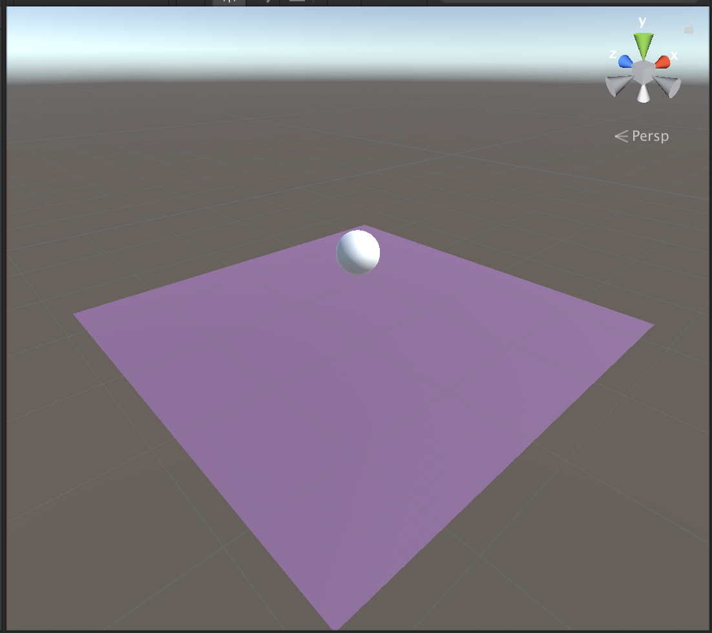
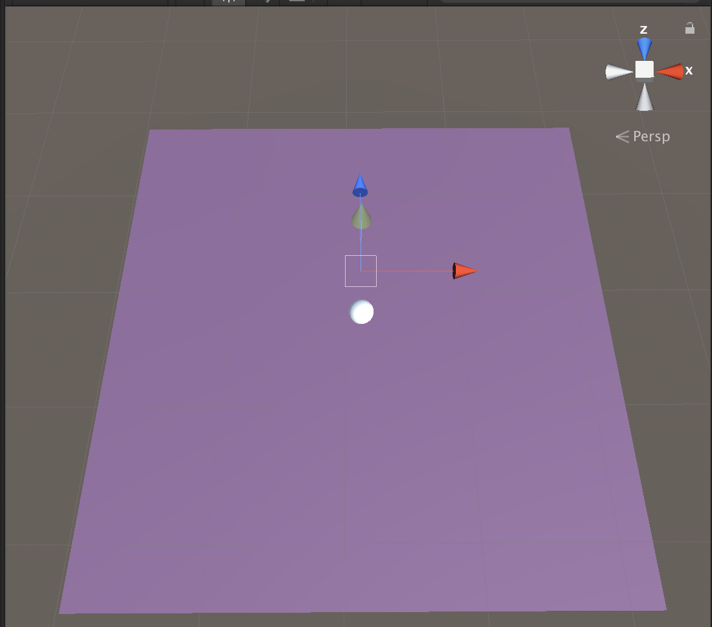
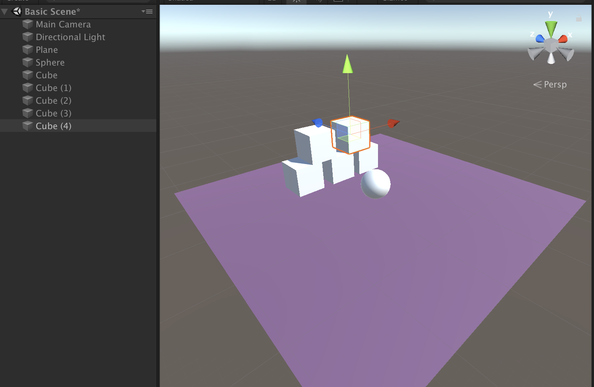
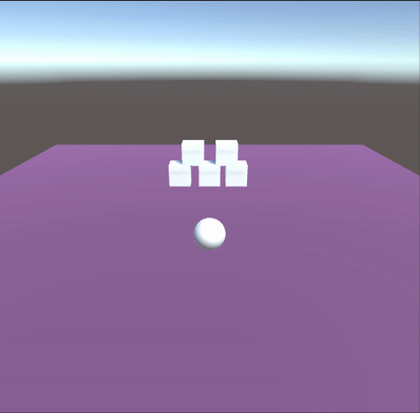

# Roll a Ball Obstacle Course
Unity Version: 2019.3

## Build

### Step 1: Unity Setup

* Make sure that the teachers have Unity and Visual Studio involved.
    1. Walk through it in case they do not. 
    2. Explain Unity Hub as well 

* Explain UI and opening a new project


### Step 2: Unity Windows 
* Explain different windows
* Go over the Director/Movie set analogy 
    1. Scene View: Director walking around a set
    2. Game View: Final Cut of the movie/show
    3. Heirarchy: Items in your set
    4. Project Assets: Props that may or may not be in the set
* Explain Play Button and how it swaps to Game View


### Step 3: Basic Scene 
* Floor and 3D Shapes
* Lighting and Camera
* Navigating through scene view 



1. Add a floor plane. Scale it larger. Go over transform tools and effects of them. 
2. Add a sphere above the plane - show that it does not fall
3. Explain objects do not have any type physics by default
4. Give sphere a color. Explain materials briefly. 
5. Create an empty object. Explain 3D coordinates and components. 
6. Move camera and show how it affects Game View. Finally move it above your scene looking at the ball from a downward ish angle. Try to face towards the positive z axis - as this will pretty much be required down the line when we add controls. You might need to tweek this position and rotation later as it will be crucial when we hook our camera up to follow our ball.



### Step 4: Physics 
* Rigidbodies 

1. Add Rigidbody to sphere. 
2. Add other objects under it, at angles, etc so it can interact with them. 
3. Tilt the plane temporarily so we can see the ball interact with it
4. Show that objects can fall forever. 
5. Play around with default rigidbody settings 


### Step 5: Movement
* Our first coding script
* Controls for moving our ball 

1. Show off what it means to add a script to a GameObject. 
2. Explain Start() and Update() functions briefly. 
3. Use Debug.Log to show off the start function vs the update function. Also explain that this is how we can print messages to the console window for debugging purposes. 
4. Create if statements for all the keyboard functions (but don't fill out the any executable code inside)
5. Explain this line of code briefly, but explain that it's not crucial to understand the syntax or symantics of this line of code because they're just starting out. 

`GetComponent<Rigidbody>().AddForce(Vector3.up)`

6. Add the public floats for jumpStrength and moveStrength.
* Talk briefly about how public variables can be set in the inspector. And maybe just a bit about how the vector inside AddForce chooses the direction, and our variable chooses the strength in that direction (magnitude). 
* Use it in the AddForce Method (see code below). 
* Tell them to experiment with the values in the inspector. 

```csharp
public float jumpStrength; 
public float moveStrength; 

void Update()
    {

        if (Input.GetKeyDown("space"))
        {
            GetComponent<Rigidbody>().AddForce(Vector3.up * jumpStrength);
        }
        if (Input.GetKey("w"))
        {
            GetComponent<Rigidbody>().AddForce(Vector3.forward * moveStrength);
        }
        if (Input.GetKey("a"))
        {
            GetComponent<Rigidbody>().AddForce(Vector3.left * moveStrength);
        }
        if (Input.GetKey("s"))
        {
            GetComponent<Rigidbody>().AddForce(Vector3.back * moveStrength);
        }
        if (Input.GetKey("d"))
        {
            GetComponent<Rigidbody>().AddForce(Vector3.right * moveStrength);
        }
    }
```


### Step 6: More Objects!
* Checking Rigidbody collisions

1. Add a cube. 
2. Try to collide with Cube. Note what happens. 
3. Add Rigid body to cube. What happens? 
4. Now try to collide with cube. 
5. Duplicate cube and make tower or pyramid that we can knock down. 
6. Play with rigidbody parameters when impacting the cubes. 




### Step 7: Attached Camera 
* Vector and Offset 
* Transforms 
* More on Public Variables 
 
1. Create new script for CameraController and attatch it to the Camera. 
2. Add public variables for ball and offset. Declare the GameObject ball and explain that all items inside Unity heirarchy are GameObjects. And that a GameObject consists of a transform and components. Go over transforms and show off components again. Declare an empty object as example. 
3. Show off that we can drag items into public variables. Drag sphere/player ball into reference. 
4. Add code for Update function to set ball to camera. 
`transform.position = ball.transform.position;`
Explain that we are setting the position of whatever this script is attatched to - to the position of the ball. Show off in play mode. 
5. Show off the Start function. Use Debug.Log()
6. Update the line of code to put an offset in. Set the offset in the Start Function. 


```csharp
public class CameraController : MonoBehaviour
{
    public GameObject ball;
    private Vector3 offset;

    // Start is called before the first frame update
    void Start()
    {
        offset = transform.position;
    }

    // Update is called once per frame
    void Update()
    {
        transform.position = ball.transform.position + offset;
    }
}
```

THAT'S IT! HAVE THEM CUSTOMIZE TO THEIR HEARTS CONTENT :)) ADD LOTS OF BLOCKS FOR FUN AND DESTRUCTION. 

Show off more customizable materials if time. And maybe the other 3D shapes etc. 

If lots of extra time, you can start making an obstacle course. 




